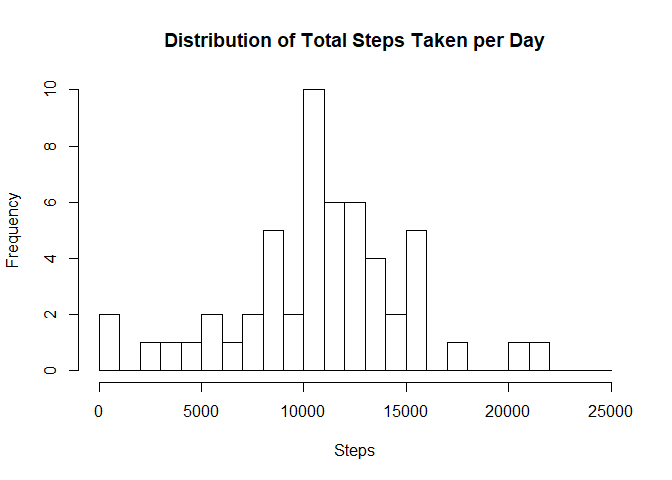
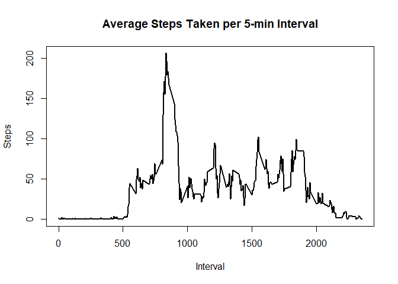
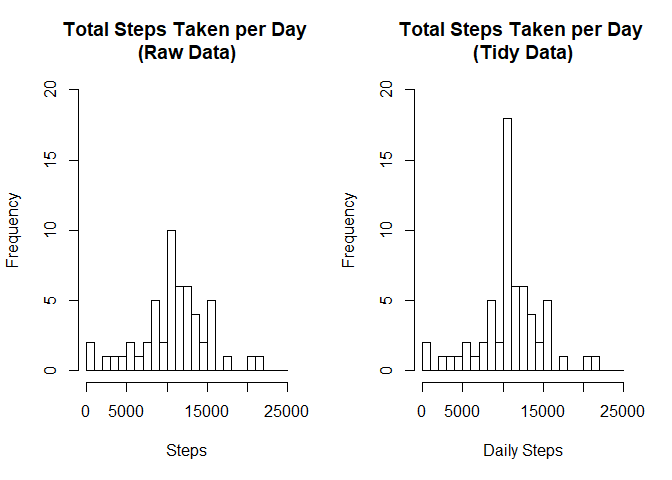
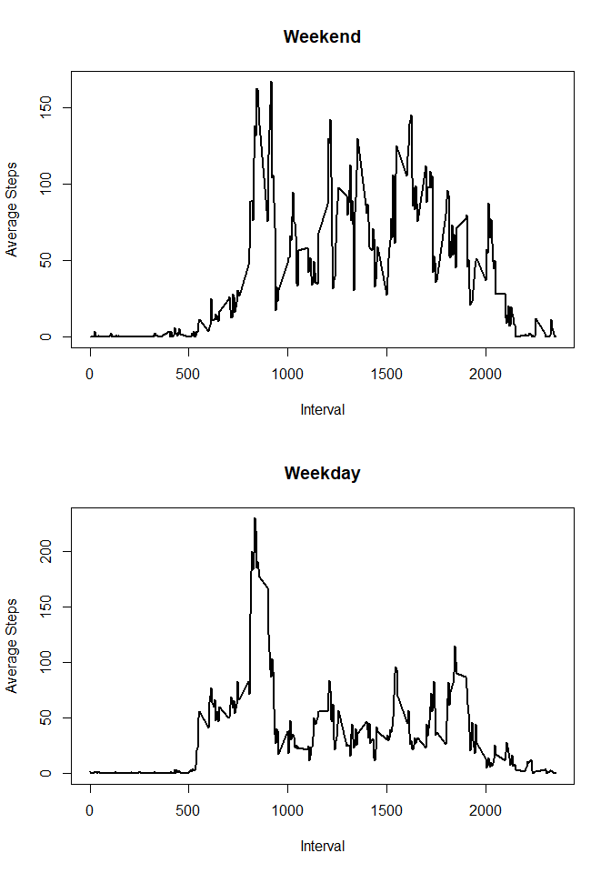

---
title: "Reproducible Research: Peer Assessment 1"
output: 
  html_document:
    keep_md: true
---
by Darryl Ma


```r
knitr::opts_chunk$set(fig.path = "./figure/")
knitr::opts_chunk$set(echo = TRUE)
knitr::opts_chunk$set(include = TRUE)
```

## Introduction

This assignment makes use of data from a personal activity monitoring device. This device collects data at 5 minute intervals through out the day. The data consists of two months of data from an anonymous individual collected during the months of October and November, 2012 and include the number of steps taken in 5 minute intervals each day.

The variables included in this dataset are:

- steps: Number of steps taking in a 5-minute interval (missing values are coded as \color{red}{\verb|NA|}NA)
- date: The date on which the measurement was taken in YYYY-MM-DD format
- interval: Identifier for the 5-minute interval in which measurement was taken

The dataset is stored in a comma-separated-value (CSV) file and there are a total of 17,568 observations in this dataset.

## Loading and preprocessing the data

The following code:

- loads libraries that will be used in the subsequent analyses (Note: Please intall the "timeDate" package first if you have not already done so (i.e. install.packages("timeDate")))
- unzips and stores the dataset into a variable
- converts the dates in the dataset from character strings into POSIXct format


```r
library(timeDate)
unzip("activity.zip")
activity_data <- data.table::fread(input = "activity.csv")
activity_data$date <- as.POSIXct(activity_data$date, format = "%Y-%m-%d")
```

## What is mean total number of steps taken per day?

As each entry in the dataset represents a 5-minute interval in a day, the following code sums up all the steps in a day, then plots a histogram of the daily steps to give a view of the distribution of total steps taken per day throughout October and November 2012.


```r
daily_steps <- aggregate(steps ~ date, activity_data, sum)
hist(daily_steps$steps, 
     xlab = "Steps", ylab = "Frequency", 
     main = "Distribution of Total Steps Taken per Day",
     breaks = seq(0, 25000, 1000))
```

<!-- -->

```r
mean_daily_steps <- mean(daily_steps$steps, rm.na=TRUE)
median_daily_steps <- median(daily_steps$steps, rm.na=TRUE)
```

The mean and median total number of steps taken per day by this individual throughout October and November 2012 is 10766 and 10765, respectively. 

## What is the average daily activity pattern?

The following code aggregates the data by averaging the steps taken per interval over all the days, then plots this average across all the 5-min intervals.


```r
interval_steps <- aggregate(steps ~ interval, activity_data, mean)
with(interval_steps, plot(interval, steps, 
    xlab = "Interval", ylab = "Steps",
    main = "Average Steps Taken per 5-min Interval",
    type = "l", lwd = 2))
```

<!-- -->

```r
interval_max_steps <- interval_steps$interval[which.max(interval_steps$steps)]
```

The max number of steps on average occurs at interval 835 (i.e. 835AM) 

## Imputing missing values


```r
num_missing_data <- sum(is.na(activity_data$steps))
```

There are a total of 2304 missing values in the dataset. To address this issue, I have filled in the missing data with the mean of the corresponding 5-min interval. The results of the tidy dataset are written into a new csv file ("tidy_activity.csv").


```r
tidy_activity_data <- merge(activity_data, interval_steps, by = "interval")
tidy_activity_data$steps.x <- as.numeric(tidy_activity_data$steps.x)
tidy_activity_data[is.na(tidy_activity_data$steps.x),"steps.x"] <- 
    tidy_activity_data[is.na(tidy_activity_data$steps.x),"steps.y"]
tidy_activity_data <- tidy_activity_data[,c(1:3)]
names(tidy_activity_data)[2] <- "steps"
write.csv(tidy_activity_data, file = "tidy_activity.csv")
```

The following graphs demonstrate that there is not too much of a difference after tidying the dataset by replacing all missing values with the mean of the corresponding 5-min interval. As expected the frequency at the mean increases.


```r
tidy_daily_steps <- aggregate(steps ~ date, tidy_activity_data, sum)
par(mfrow = c(1, 2))
hist(daily_steps$steps, 
     xlab = "Steps", ylab = "Frequency", 
     main = "Total Steps Taken per Day \n(Raw Data)",
     ylim = range(c(0,20)), breaks = seq(0, 25000, 1000))
hist(tidy_daily_steps$steps, 
     xlab = "Daily Steps", ylab = "Frequency", 
     main = "Total Steps Taken per Day \n(Tidy Data)",
     ylim = range(c(0,20)), breaks = seq(0, 25000, 1000))
```

<!-- -->

```r
mean_tidy_daily_steps <- mean(tidy_daily_steps$steps)
median_tidy_daily_steps <- median(tidy_daily_steps$steps)
mean_difference <- mean_tidy_daily_steps - mean_daily_steps
median_difference <- median_tidy_daily_steps - median_daily_steps
```

The mean and median total number of steps taken per day after tidying the dataset remain almost the same at 10766 and 10766, respectively. The difference for the mean and median is respectively, 0 and 1.189. Therefore we can conclude the impact of imputing missing data on the estimates of the total daily number of steps is low.

## Are there differences in activity patterns between weekdays and weekends?

The code below appends a new column to the clean dataset to identify if the date falls on a weekday or weekend.


```r
weekend_weekday_map = data.frame(day.of.week = 
    c("Monday","Tuesday","Wednesday","Thursday","Friday","Saturday","Sunday"), 
    day.category = 
    c("weekday","weekday","weekday","weekday","weekday","weekend","weekend")) 
tidy_activity_data$day.of.week <- weekdays(tidy_activity_data$date) 
tidy_activity_data <- merge(tidy_activity_data, 
    weekend_weekday_map, by = "day.of.week")
```

The following code aggregates the data by averaging the steps taken per interval over all weekdays and all weekend days throughout October and November 2012, then plots this average across all the 5-min intervals to demonstrate the difference in the average steps taken by the individual per 5-min interval between a weekday and weekend.


```r
par(mfrow = c(2, 1))
weekend_interval_steps <- aggregate(steps ~ interval, 
    tidy_activity_data[tidy_activity_data$day.category == "weekend",], mean)
weekday_interval_steps <- aggregate(steps ~ interval, 
    tidy_activity_data[tidy_activity_data$day.category == "weekday",], mean)
with(weekend_interval_steps, plot(interval, steps, 
    xlab = "Interval", ylab = "Average Steps", 
    main = "Weekend", type = "l", lwd = 2))
with(weekday_interval_steps, plot(interval, steps, 
    xlab = "Interval", ylab = "Average Steps", 
    main = "Weekday", type = "l", lwd = 2))
```

<!-- -->

Based on the plots, we see that the individual's physical activity is more equally distributed throughout the waking hours of a weekend day (i.e. 7am until 8pm), where else on a weekday, majority of the individual's physical activity occurs before 10am. We can also deduce that on average this individual goes to bed around 9-10pm and wakes up around 5-6am everyday. 
